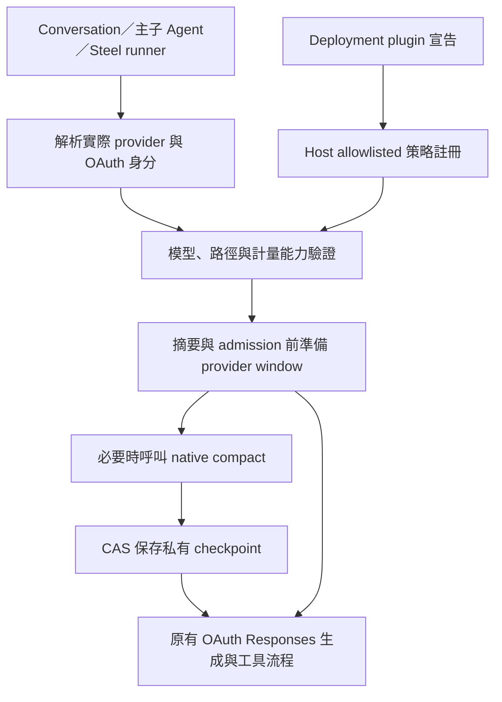

# OpenAI OAuth 原生 compaction：LibreChat 接入研究

研究日期：2026-09-30。程式基準：`6beb372fb84c3c092154ce20e6ed1851d9fdb0d4`。

本文是研究與建議設計，沒有實作或啟用 compaction，也沒有發出真實 OAuth 推論／壓縮請求。方案已經過獨立架構審查。

## 結論與範圍

建議將原生 compaction 做成可信任、靜態編譯的 LibreChat backend 模組，透過現有 deployment plugin 的宣告啟用／停用。一般 OAuth conversation、主 Agent 與子 Agent 共用同一個 provider context 策略；每個執行緒保存獨立的壓縮狀態。

目前不能只新增 `hooks.json` 就完成：現有外掛無法替換模型輸入、存取完整原始 Responses window，或保存 provider checkpoint。主程式與 `@librechat/agents` 必須先補上有限的接點。外掛可移除的部分是策略啟用與設定，可信任的策略程式仍由 API host 編譯提供。

啟用條件必須同時成立：實際解析出的 provider／endpoint 是 OpenAI OAuth、transport 使用 OAuth 身分、該 model／route／account 已通過 compaction 與計量驗證、部署外掛已啟用。不能靠 `gpt-*` 名稱判斷，也不能因為主 Agent 使用 OAuth 就替非 OAuth 子 Agent 啟用。

完整涵蓋範圍包含 graph conversation／主子 Agent、背景續跑，以及直接呼叫 OAuth model 的 Steel 報價主子流程。OCR 整理等直接呼叫另列驗證；單次標題生成沒有歷史可壓縮，單次超大的 PDF／工具輸入仍需切分。

## 官方能力與尚未證實的相容性

OpenAI 文件提供兩種模式：

| 模式 | 方式 | 對本專案的影響 |
| --- | --- | --- |
| Server-side | `/responses` 帶 `context_management`，串流輸出 compaction item | 需要 transport 支援參數，以及 SDK 保留新的原始輸出項目 |
| Standalone | `/responses/compact` 回傳下一個 context window | 建議優先評估，壓縮時機與失敗處理較容易接入 LibreChat |

Standalone 回傳的 **整份 `output`** 是下一個 context window，不能只取 encrypted compaction item，也不能任意裁掉保留項目。送去 compact 的 window **仍須在模型的 context limit 內**。因此必須提前觸發；不能等整份輸入已超量才期待 API 自動修復。[官方 compaction 指南](https://developers.openai.com/api/docs/guides/compaction)、[compact API](https://developers.openai.com/api/reference/resources/responses/methods/compact)。

目前安裝的 OAuth core 預設呼叫 `https://chatgpt.com/backend-api/codex`。它有通用 `transport.request`，但可轉送一個路徑不代表後端授權該功能；`/responses` 的 body 正規化與相容性 headers 也不會自動完整套用到 `/responses/compact`。

新的 Sign in with ChatGPT 文件支援 public Responses OAuth，但不能據此認定現有 Codex OAuth token 相容；文件列出的 Code Interpreter 限制也與目前 Steel 用法有關。**本方案不順便遷移 OAuth transport。** [官方模型與推論文件](https://developers.openai.com/siwc/token-sharing-open-source/models-and-inference.md)、[preview 限制](https://developers.openai.com/siwc/token-sharing-open-source/preview-limitations.md)。

Codex app-server 的 `thread/compact/start` 管理自己的 thread。將 LibreChat 整個執行引擎改交給它會改變工具、串流與 thread 所有權，不能當作任意 LibreChat history 的小型壓縮外掛。[官方 app-server 文件](https://developers.openai.com/codex/app-server)。

## 現有程式的關鍵缺口

檢查版本：`@librechat/agents` 3.9.8、`@ai-sdk/openai` 3.0.85、`@openai-oauth/core` 2.0.0。

| 層 | 已確認的行為 | 必要接入 |
| --- | --- | --- |
| OAuth adapter | `responsesState:false`，由 LangChain 訊息重建一般輸入；沒有原生 compact window | 保留／重放原始 Responses items 的私有 adapter |
| AI SDK | 本機 mock 顯示 `contextManagement` 未送出，compaction item 未保留 | 升級到已驗證的支援版本，或提供型別完整的 raw bridge |
| Agent SDK | 自動摘要與 context overflow 檢查會在 model／fetch 前執行 | 在摘要與 admission 前提供可等待的 provider context 策略接點 |
| 主／子模型建立 | OAuth override 目前只套用單一 top-level Agent；沒有設置子 Agent override | 依每次解析完成的 provider 建立 model／策略，涵蓋 child factory 與 resume |
| 外掛 | manifest extensions 是 JSON 宣告；PreCompact／PostCompact 是觀察事件 | host 新增 allowlisted 策略的宣告解析與註冊 |
| 持久化 | 有 actor CAS 與 Mongo graph checkpointer，沒有 opaque provider state 合約 | host 私有、可續跑的 provider checkpoint |

不能只攔截 fetch：SDK 可以在 fetch 前就拋出 context overflow。也不能提高假的 context cap、把 encrypted payload 放入普通 `SUMMARY`，或以 ciphertext 的文字 token 數作為壓縮後大小。

一般摘要與 fallback 目前另呼叫 `initializeModel`，不自動沿用 root OAuth override。符合 native 策略的請求應在這些路徑之前選擇 native compaction；其他 provider 保持既有摘要。Fallback 必須重新判斷 provider 資格與有效輸入。

### 本機 SDK probe

測試使用真正安裝的 OpenAI AI SDK 與假的 fetch／SSE，沒有外部網路請求。餵入 `contextManagement` 設定與 compaction `output_item`，結果如下：

```json
{
  "networkCalls": 0,
  "contextManagementForwarded": false,
  "compactionPreserved": false
}
```

這只能證明目前 SDK bridge 的缺口，不能證明真實 OAuth 後端支援或拒絕 compact。

## 建議模組設計



建議新模組位置為 `packages/api/src/providers/openai/compaction/`；此路徑與下列契約均為提案，尚未存在。

### 1. Host 與外掛分工

- Host 靜態編譯一個 OAuth compaction 策略，提供有限的 selection／projection／storage 介面。
- Deployment plugin 使用 `extensions["ai.librechat"]` 宣告選用 host allowlist 中的策略與設定。現有 manifest 尚無這項 consumer，必須新增驗證與載入。
- 設定只需要啟用、已驗證 model／policy 與提前壓縮餘裕，避免另建通用外掛程式載入平台。
- 不把 OAuth credentials 交給 shell hooks／MCP／外掛命令。既有 hooks 可接收壓縮活動通知，但不負責執行模型輸入轉換。
- 停用後使用原有流程。解除安裝要停用選擇、禁止重用其 checkpoint 並清理私有記錄；直接移除部署目錄則在重啟時停用，依保留期限清理孤立記錄。

### 2. Provider projection 與壓縮範圍

LibreChat 原始對話、工具結果、附件與 OCR artifacts 保持為 canonical history；壓縮只改變送給模型的私有 window。

在實際 provider serialization 後建立來源 fingerprint，包含 system／developer instructions、tool 定義與順序、`additional_tools`／Responses-lite 的轉換，以及已過濾的 OCR provider input。不要只 hash Mongo messages。

每次提交 compact 的範圍須明確記錄：已完成 prefix／range、來源 revision、實際 provider items digest，以及刻意未提交的 tail。完整的 compact `output` 只替換這個確切範圍；只有來源 revision 證明尚未涵蓋的 tail 才能追加。已提交的 user／tool item 不得再追加一次。

壓縮邊界不得拆開 function call／result 配對，不得在 compact retry 重跑外部工具。原始輸出與 checkpoint 更新要依完成事件驗證；中途取消或未完成回應不能當成成功。

現有 V3／LangChain bridge 會遺失部分 raw items。需要原始輸出保留與下一次原始輸入重放的合約；先做 standalone compact，inline 模式等 route 與 parser 支援實證後再評估。

### 3. 觸發與 truthful budget

在自動摘要與超量 admission 之前評估策略，使用已驗證的模型 window，預留當次 instructions、tools 與生成空間。`@librechat/agents` 目前沒有可注入的 typed async 接點，需要正式 SDK 版本擴充，優先 upstream release；必要時採維護中的 dependency release，不能直接改 `node_modules`。

**Opaque 計量是啟用的必要條件。** 不能 tokenizer encrypted content，也不能假定 compact 的 `usage.output_tokens` 就等於下次輸入 window 的大小。第一階段須驗證 provider 支援的計量方式或可信任的保守 projection；無法證實時，該 model／path 保持停用。

官方 OpenAPI 另有 `POST /responses/input_tokens`，回傳 `response.input_tokens` 計數，應列為第一個評估的計量接點。但目前未實測既有 OAuth token／Codex 後端是否授權此路徑，或是否正確接受 compact output 與當次 instructions／tools；不能直接視為已解決 opaque 計量。[官方 input token count API](https://developers.openai.com/api/reference/resources/responses/subresources/input_tokens/methods/count)。

Native 失敗後，只能改走能產生有效請求的既有 canonical-history 摘要／projection；否則回傳可恢復的 context-limit error。不得原封不動重送超量輸入。

已超量歷史若要後續支援逐段 bootstrap，每個完整 prefix 請求都必須獨立符合 budget，並保留每次完整 compact output。單個過大輸入仍須分段。Compaction 不會解除 subscription quota 或 TPM 限額。

### 4. 私有持久化與隔離

使用 host 管理的 Mongo provider state：若現有 checkpoint namespace 能提供所需隔離與 CAS 就重用，否則新增有限的私有 schema。不要把 opaque window 塞入 actor summary／semantic index，也不要只放 process Map 或 `PLUGIN_DATA` 檔案。

Identity 至少包含 tenant、user、OAuth account／transport、model、conversation branch 與實際 execution thread／executing Agent。不能只使用 Agent template ID，亦不能把子 Agent window 共用成父 Agent window。

記錄完整 compact output、covered range／provider digest、來源 generation／revision、formatter／strategy fingerprint 與經驗證的計量資訊。沿用 actor／runner／checkpointer 的 CAS 與 execution lease，防止平行生成或跨 replica 續跑提交過時結果。

Branch、edit、regenerate、model／OAuth account／endpoint 切換，或 instructions、tools／順序、additional tools、formatter／projection／strategy 更新時失效。重建仍要通過正常 admission。

這些資料包含保留的 plaintext 與 provider opaque state，應透過已驗證的 host 私有授權與資料庫 at-rest 保護保存。落實 payload log redaction、有限保留期限，以及 conversation／OAuth account 刪除與外掛卸載清理；不出現在一般 message API、匯出、外掛命令或 admin payload 診斷中。不新增獨立加密平台。

Timeout、401、429、不支援、取消與過時 CAS 都不得覆寫既有成功 checkpoint 或 canonical history。Refresh／retry 有限且在 generation 前完成。切換到其他 provider 時重新由 canonical history 建立有效 projection，不攜帶 OAuth opaque state。

## 必須涵蓋的呼叫矩陣

理想上在每次最後解析完成的 OAuth Responses invocation 共用 adapter；graph 仍需要提前 budget 接點。不能只靠 Agent template 設定宣稱完整覆蓋。實作前須逐項確認 call site 與測試。

| 流程 | 現有接點／差異 | 預期驗證 |
| --- | --- | --- |
| 一般 OAuth conversation／主 Agent | `createRun` → single-agent graph override | fresh、下一輪與 HITL resume 使用正確 checkpoint |
| OpenAI-compatible／Responses controller | 同樣建立 Run，但 ingress／output 會重建訊息 | streaming／nonstreaming、raw state 與外部 API 格式分離 |
| Multi-agent／handoff | single-root override 不適用 | 每個 resolved Agent 分別判定 OAuth 與狀態 |
| 前景／nested／self 子 Agent | child model factory 另建模型 | eager／lazy／self 路徑均接入；混合 provider 不誤啟用 |
| 背景／detached 子 Agent | graph 與 hooks snapshot／resume | 中斷、重啟、跨 replica 續跑與 CAS |
| Steel 報價主／子流程 | direct native model + durable runner | 主／子輪次、runner checkpoint、retry 不重做工具 |
| OCR delegate／organizer | direct native model | 有多輪 context 時接入；單次大檔走既有切分 |
| 標題 | direct one-shot model | 無累積歷史時不呼叫 compact，不改 title env 行為 |
| 摘要／provider fallback | 不沿用 root override 的 initializer | eligibility 重判、有效 budget、opaque state 不外流 |
| Legacy Assistants thread runs | 獨立 Assistants API，沒有 native OAuth graph seam | 不宣稱覆蓋；本功能限定真實 OAuth Responses |

## 建議實作順序與驗收

1. **Capability spike。** 用授權的可拋棄測試對話、`gpt-6.1-sol` 與現有 auth loader，驗證 compact route／schema／headers、完整 window replay、後續 `response.completed`、tool pair、取消與 opaque 計量。只保存移除 tokens／encrypted payload／客戶內容的結構 fixtures。未通過則停止該能力的啟用。
2. **Host／SDK 接點與 root 路徑。** 新增 typed pre-admission 策略、raw window adapter 與私有 checkpoint 合約。驗證完整 output、不重複 tail、instructions／tools fingerprint，以及原本 guards 不被繞過。
3. **所有主子與直接 runner 路徑。** 按矩陣完成接入；驗證每個 OAuth 呼叫的隔離、背景／HITL／跨 replica 續跑，以及 Steel runner 的 idempotency。
4. **外掛啟用與現有手動 compact。** 新增 declarative consumer，預設停用；原有 compact 操作對 eligible context 使用同一個 native engine，顯示適當活動狀態，不製造假的普通 Summary。
5. **回歸與解除安裝。** API-key／Azure／Anthropic／非 OAuth 子 Agent 負向測試、branch／account／model 失效、平行 CAS、串流完成／abort／error、停用／卸載清理，以及受影響 workspace build。Provider／OCR 修改須完成 [Steel provider input guards](steel-provider-input-merge-guards.md)。

尚未解決的啟用關卡：現有 OAuth token／後端的 compact 授權、opaque window 的可靠 admission 計量、raw bridge 完整性，以及 SDK 擴充是否能由 upstream 正式版本提供。這些是驗證條件，不能當成已支援的功能。

## 原始碼證據索引

以下行號以研究基準與當時安裝的 dependency 為準。

| 證據 | 位置 |
| --- | --- |
| OAuth stateless provider、相容性 fetch | [oauth.ts](../packages/api/src/steel/native/oauth.ts)，147–212 |
| prompt／call options／output bridge／graph model | 同檔 464–518、882–920、1049–1288、1305–1418 |
| provider state 選擇 | [provider.ts](../packages/api/src/steel/native/provider.ts)，118–167 |
| root OAuth override 與 single-agent guard | [run.ts](../packages/api/src/agents/run.ts)，1884–1915、3195–3202 |
| 子 Agent shaping 與摘要狀態 | 同檔 2494–2558、2735–2739 |
| plugin manifest／貢獻欄位 | [types.ts](../packages/api/src/plugins/types.ts)，39–92；[manifest.ts](../packages/api/src/plugins/manifest.ts)，11–53、102–135 |
| plugin lifecycle／啟動接入 | [runtime.ts](../packages/api/src/plugins/runtime.ts)，96–145；[index.js](../api/server/index.js)，241–253 |
| PreCompact／PostCompact 外掛 payload | [hooks/runtime.ts](../packages/api/src/agents/hooks/runtime.ts)，297–311 |
| 私有持久化可重用的 CAS／resume 機制 | [conversation.ts](../packages/data-schemas/src/methods/conversation.ts)，1099–1200；[checkpointer.ts](../packages/api/src/agents/checkpointer.ts)，143–159、665–691 |
| Steel quotation direct model／runner | [model.ts](../packages/api/src/steel/quotation/model.ts)，102–185；[runner.ts](../packages/api/src/steel/quotation/runner.ts)，219–256、567–620 |
| OCR 與 title direct OAuth 呼叫 | [ToolService.js](../api/server/services/ToolService.js)，1917–1985、2516–2583；[title.ts](../packages/api/src/steel/native/title.ts)，336–383 |
| SDK admission 與 child factory | `node_modules/@librechat/agents/src/graphs/Graph.ts`，4135–4167、4359–4360、5268–5304、5361–5445 |
| SDK observational compaction hooks | `node_modules/@librechat/agents/src/summarization/node.ts`，907–935、1324–1347 |
| SDK 原始 compaction item 缺口 | `node_modules/@ai-sdk/openai/src/responses/openai-responses-api.ts`，input／output 與 SSE item unions |

本次只新增研究文件；檢查方式為官方文件／installed source 交叉核對、本機 mock probe、獨立設計審查及 `git diff --check`。沒有 runtime、env 或 DB 變更，也沒有 commit／push／deploy。
