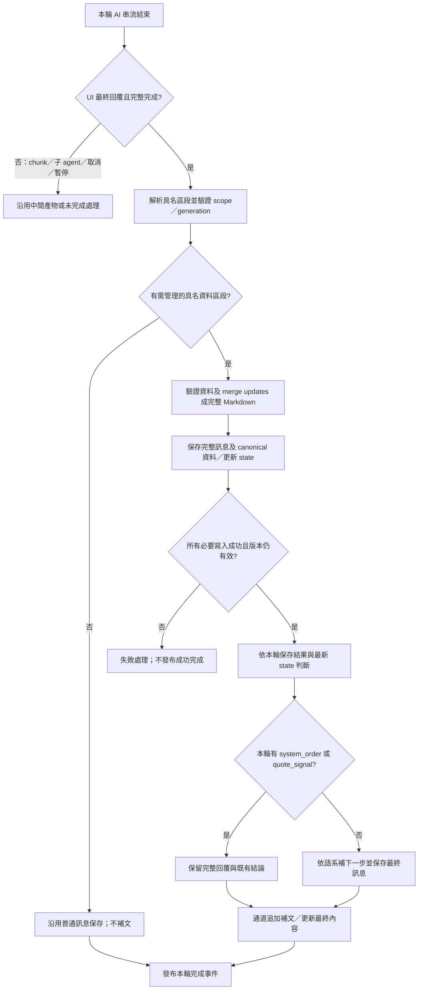

# Steel 最終 Markdown 統一收尾架構與遷移計畫

## 最新決定與範圍

本文件取代 `2026-10-02-steel-agent-next-steps.md` 中以一般 agent／OCR 模式／flow 標記排除補文的舊設計。新的判斷入口是「本輪送到 UI 的最終回覆」，不以模型套用的 agent 規則或 OCR 模式區分。

- AI 的本輪串流結束後，後端統一處理最終 Markdown：驗證、merge updates、保存完整資料與訊息、更新 state，再判斷是否在結尾補下一步。
- `ocr_result` 與完整 `customer_data` 保存成功後，都觸發下一步判斷；本輪的 `ocr_result_updates` merge／保存成功後，也觸發相同判斷。
- 本輪有完整 `system_order` 時不補下一步。`system_order_updates` merge 後成為完整 `system_order`，因此同樣不補，保留原有報價結論。
- `chunk markdown` 屬於子 agent 的中間結果，**不觸發最終回覆收尾或下一步**。沿用其 artifact 保存，不將 `ocr_result_chunk` 當成完整 `ocr_result`。子 agent 的其他中間回覆也不觸發。
- OCR 主 agent 的最終結果若直接呈現在 UI，仍須經過統一收尾。內部主 agent 合併產物若尚未成為 UI 的本輪最終回覆，不觸發。
- 普通文字、單純 Markdown 排版及單獨 `quote_signal` 不產生下一步。`quote_signal` 保留既有開始報價契約，不添加要求再次報價的提示。
- 取消、未完成、等待工具核准，以及驗證、merge 或保存失敗，都不得添加成功導向的下一步，亦不得發布成功完成事件。
- 文案依本輪系統語系選擇中／英文。客戶／等級變更仍重輸出完整 `customer_data`；不引入 `customer_data_updates`。
- 子 agent AI 只輸出規定的 Markdown 表格，**不需要產生 `## label`**。後端依已知的 OCR／報價 chunk 流程加入 label，驗證、auto save DB，再按各流程準備主 agent 輸入；label、保存與交接都由後端管理。報價保持後端先整理子 agent 結果，主 agent 接收完整 `system_order` 與 `review_remarks`。
- OCR 的 Markdown label 與來源 metadata 全部由後端處理，包括來源代碼、檔名、頁碼範圍及 chunk 數量；OCR AI 負責其工作範圍內的辨識、核對、整理及 Markdown 內容輸出，不自行建立 metadata。
- AI rules 只描述 AI 的工作、實際可見輸入與輸出要求；不描述後端的標記、metadata 生成、merge、DB 保存、state 更新、交接、重試屏障或下一步補文流程。

## 唯一觸發邊界

兩種外部回覆通道共用唯一的 `finalizeSteelMarkdownTurn` TypeScript 收尾服務，位於 `packages/api/src/steel/markdown/completion.ts`。`api/server/controllers/agents/request.js` 與 `responses.js` 只提供通道 adapter；內部 OCR chunk、子 agent、工具呼叫及每次 token delta 均不直接呼叫它。

串流正文可以先顯示；補文與成功完成事件必須等待保存完成。UI agent 通道更新最終訊息，Responses 通道在文字 done／response completed 之前送出補文 delta；wire、最終事件與保存訊息的文字必須一致。

## 子 agent chunk：後端標記、保存與交接

| 流程 | AI 輸出 | 後端保存的 Markdown | 主 agent 交接 |
| --- | --- | --- | --- |
| OCR 子 agent | 該 chunk 規定欄位的完整 Markdown 表格；不要求標題 | 後端加入唯一的 `## ocr_result_chunk` | 沿用 chunk 內容與來源 metadata 的整理輸入 |
| 報價子 agent | 該 chunk 規定欄位的完整 Markdown 表格；不要求標題 | 後端加入唯一的 `## system_order_chunk` | 後端先整理為完整 `system_order` 與 `review_remarks`，再交主 agent 核對 |

處理順序固定為：子 agent 完成表格 → 後端依呼叫時的流程類型加入 label → 驗證表格與來源範圍 → auto save DB → 讀回／確認保存成功 → 後端按流程準備主 agent 輸入。報價在最後一步先整理已保存的子 agent 結果，再提供完整 `system_order` 與 `review_remarks`。

流程類型、chunk index、來源頁段／列識別與 run／generation 都來自後端呼叫上下文，不讓 AI 指定。共用的 `normalizeSteelChunkMarkdown` 接受這些明確資料；label 只作保存與輸入的資料識別，不能單靠文字 label 將子 agent 輸出升格為完整訂單或觸發 UI 收尾。

移轉期間可接受原有 AI 回傳的相符 label，移除舊標題後重建一份後端標題，不能重複加入。衝突標題、重複資料區段或不符合指定表格的內容，依既有修復／重試處理，不把它當成有效 chunk。新規則不要求子 agent 自行輸出 machine label；其固定表頭、來源範圍、逐列完整性與格式要求保留。

Chunk 保存的唯一 owner 保留在既有 OCR preprocessing／quotation runner，而非 UI 收尾服務；保存識別包含 scope、source version、chunk index／page range 或 recovery leaf path、來源列識別、run／generation 及內容版本。每份有效 chunk 保存一次，重試冪等，保存失敗不能成為主 agent 的完成輸入。分割恢復只提供有效葉節點，不同時提供父／子 chunk 而重複來源列。

目前 OCR 有 `captureOcrPreprocessingChunkMarkdown` DB memory 保存；報價有 `checkpoint`／chunk artifact 保存。遷移保留這兩個中間產物保存 owner，統一其後端 label／驗證契約，主 agent 的正式輸入使用 DB 已保存、且符合本次 scope／版本的結果，不使用尚未保存的 AI 暫存文字。

目前 delegate OCR 整理輸入可見 `ocr_result_chunk`；一般 OCR 主整理從 runtime context 接收 chunk 內容。報價保持現有交接：後端從已保存、已驗證的子 agent chunk 組成完整 `system_order` 與 `review_remarks`，再提供主 agent；既有 `order`、`customer` 輸入亦沿用，不新增原始 `system_order_chunk` 列表。Chunk label 與保存 metadata 供後端管理、驗證與整理，不擴大報價主 agent 的輸入或改變其核對／複核責任。

OCR 交接由後端組裝「已保存的 Markdown＋後端 label＋必要來源 metadata」。來源代碼沿用同一對話的來源 mapping，檔名與頁碼範圍取實際檔案／分頁資料，chunk 數量取實際處理集合；不能依 AI 文字猜測、重新編號或把缺頁當成完成。AI 可依已提供的來源資訊對照資料列，但不負責建立、修改或輸出一份 metadata 管理物件。內部 DB artifact id、lease、generation／run 與版本控制資訊仍由後端管理，不因提供來源資訊而全部送給 AI。

所有 chunk 只保存中間 artifact，不更新 canonical 完整訂單，不觸發下一步。主 agent 的最終 UI 回覆才進入前述完整資料保存與補文流程。

## 資料契約與保存順序

| 本輪最終區段 | 處理與保存 | 下一步判斷 |
| --- | --- | --- |
| `ocr_result` | 驗證完整表／來源，保存完整 OCR，同步報價準備 state 的目前訂單 | 是 |
| `ocr_result_updates` | 依目前已保存版本 merge，保留未修改列；保存完整 `ocr_result`，同步目前訂單 | 是 |
| `customer_data` | 驗證目前用戶 A～F 指定或可信客戶查詢結果，保存完整客戶資料與等級 | 是 |
| `system_order` | 沿用報價完整性驗證與保存，保留既有衍生表／結論 | 否 |
| `system_order_updates` | 依 `base_hash`／`row_index` CAS 修正既有列，保存完整 `system_order` 並重建衍生客戶報價 | 否 |
| `ocr_result_chunk`／`system_order_chunk` | 後端加 label、驗證並保存 chunk artifact；OCR 沿用整理輸入，報價先整理成完整 system_order／review_remarks 再交主 agent；不進入 UI 最終收尾 | 否 |

收尾服務先讀取目前版本並完成所有資料驗證／merge，才開始寫入；沿用「完整訊息先保存，OCR state 再指向該訊息」的既有持久化屏障。必要的 canonical 寫入與 state 同步全部成功後，才建立保存成功結果，再進入補文。這些步驟尚未具備跨文件交易原子性；部分寫入成功時不得假稱整輪完成，需靠同一回覆的冪等重試完成剩餘步驟。

同一輪包含多種區段時，先驗證全部相容性，再依保存結果判斷；若其中包含完整 `system_order`，不因另外存在 OCR 或客戶表而補下一步。後端不因同輪包含客戶／訂單資料與 `quote_signal` 而拒絕；先驗證並保存該輪資料，重新讀取有效的訂單／客戶版本，data gate 通過後即接受訊號並開始報價 flow。先呈現資料、下一輪確認才輸出 signal 是 AI rules 的行為要求。訊號接受必須在補文選擇及 UI 完成事件之前完成。

客戶提交的授權邊界保持不變：新客戶身分必須來自本輪可信的 `search_customers` 查詢／選擇證據，不能由 AI 表格自行建立。只有目前用戶本人明確且無歧義的 A～F／a～f 指定等級指令可略過查詢；材料代碼中的字母、AI 輸出與引用文字不算指定。單純指定等級只能修改既有已解析客戶的等級，保留其身分與其他資料；尚無已解析客戶時，使用 canonical「未指定客戶」身分，客戶編號留空，說明為「用戶指定預設 X tier」。完整 customer_data 必須與可信查詢結果或該合法等級變更完全相符，保存時核對目前用戶指令、訂單版本與 customer preparation。多候選須由用戶選定後重新查詢；工具失敗不得冒充查無客戶或套用預設客戶。

`system_order_updates` 保留原先的精確契約：只能使用後端在 AI 實際輸入中提供的 `## system_order_revision`，由其中的 `base_hash` 與 1-based `row_index` 定位既有列。更新表欄位固定為 `base_hash`、`row_index`，再接完整原 system_order 欄名與順序；每個變更列包含全部原欄，未修改儲存格照抄，明確空白表示清除，未列出的原列維持不變。拒絕重複／越界 row index、含糊列對應、欄位缺漏、錯序、版本過期、新增／刪除列，以及同輪完整 system_order。與 quote_signal 同輪不因組合本身拒絕，仍須完成更新驗證、保存及 data gate。CAS 同時核對目前 request／generation、run、訂單 hash、客戶 preparation 與報價快照版本；不覆寫 immutable flow artifact。數量、尺寸或單重變更時，重算受影響的精確總數；資料不足則清空受影響總數，不能沿用舊總數。完整新表的 customer_quote／金額／結論由後端依完整保存結果確定性重建，不宣稱再次查價。新增／刪除材料仍走 OCR 修正及下一輪確認後重新報價。

補文不得使用本輪開始前的 `hasOcrResult`／`hasCustomerData` 或 `quotation.state` 快照。讀取保存後的最新 OCR／客戶 state 時，須核對本輪保存的版本與有效 generation；資料已被其他輪取代時走既有 supersession 處理，不以舊回覆發布成功。

## 保存成功結果與冪等性

- 收尾結果由後端產生，包含 user／tenant／conversation scope、response message id、request／generation id，以及本輪已成功保存的區段與版本。它是已等待全部必要 DB 寫入的成功結果，不是 AI 回傳值，也不是「存在 finalization 物件」即可視為成功。
- 不以裸 `pendingOrderPersisted=true`、`ocrTurnActive` 或 flow 標記證明本輪資料已保存。既有 pending／delegate 保存路徑遷移期間，要回傳有 scope、目標訊息、generation／run 與版本的持久化結果，並在收尾前核對；過期、取消、被取代或版本不一致不得沿用。
- 相同 scope＋response message id＋generation 的重試只重用相同版本結果；不同內容不得以同一識別覆寫已保存結果。沿用現有 generation／hash／客戶 preparation CAS。
- 一個最終回覆只有一個收尾 owner。UI／Responses adapter 不各自再 merge 或判斷下一步；通道重連與訊息重送不重新觸發資料寫入。
- 每次重試從 canonical 正文組裝最終訊息，不在已裝飾文字上反覆 append；補文最多一份。最後的保存失敗不得送成功完成事件。
- 「訂單保存成功」與「含補文訊息保存成功」是兩個屏障；只有兩者都完成才發布相符的最終 UI／Responses 回覆。
- 接受 signal 前將 `completionReceipt` 與 ticket 一起持久化，記錄原回覆 hash、已驗證的 canonical Markdown，以及本輪 OCR generation／hash、報價修正 hash。跨 request 重試須匹配原文或已保存的 canonical 正文，並通過 ticket 的 scope、response、accepted run、訂單、customer preparation／身份／內容與相關 OCR／報價版本屏障；不能重新 merge 或把原本的報價要求排入修正佇列。
- 同一 request 的報價 flow 最終輸出保留先前已串流的正文，僅驗證新報價區段；以本請求已提交的 workflow receipt 避免再次 merge 原修正。Pending 交接則以有版本的 branded publication 驗證末尾 canonical 正文，對完整多段回覆重新發出精確的 publication，不依 AI 文字宣告保存成功。

## 下一步文案

| 保存後有效狀態 | 中文 | English |
| --- | --- | --- |
| 無完整 `ocr_result` | 下一步：請先提供材料訂單。 | Next step: Please provide a material order first. |
| 有完整 `ocr_result`，無有效客戶等級 | 下一步：1. 請確認訂單中的材料資料。2. 請提供客戶名稱以確認客戶等級，或回覆「使用預設 B 級進行報價」。 | Next steps: 1. Confirm the material details in the order. 2. Provide the customer name to determine the customer tier, or reply “Use default Tier B for the quote”. |
| 有完整 `ocr_result`，有有效 A～F 客戶等級 | 下一步：已收到材料訂單與客戶等級，請確認資料後回覆「報價」。 | Next step: The material order and customer tier are available. Please confirm the details, then reply “Quote”. |

## 舊入口移除與改接清單

移除的是重複的收尾 owner／直接寫入入口，保留並重用必要的驗證、merge、CAS、audit、delegate journal、artifact 與失敗處理；不可直接刪掉這些保障。

| 目前入口 | 計畫處理 | 保留的責任 |
| --- | --- | --- |
| `request.js` 的 `prepareOcrResponseFinalization`、OCR result save／retry 與末尾 `finishSteelAgentResponse` 分散區段 | 將資料收尾行為移入共用 TS 服務；controller 只呼叫一次最終收尾並發布通道事件 | terminal ownership、取消／暫停、原有訊息持久化屏障及 stream 完成事件 |
| `responses.js` 的 `saveResponseOutput` 內 OCR merge／save 與補文 | 移除另一份 OCR 收尾行為，改接同一服務 | Responses 訊息形狀、usage 及安全失敗事件 |
| `services.ts` 的 `saveOrderWithoutMessage` 與 `transport.ts` 的 store=false 另路 merge／finish | 合併為共同資料收尾；storage／transport 選項不建立第二個 canonical 保存 owner | 非保存訊息模式的既有 wire 契約；目前 controller 已正規化為 durable storage |
| `completion.ts` 的一般 agent／OCR／delegate／resume／pending 排除 | 用「UI 最終回覆、成功保存、版本有效」判斷取代；chunk／子 agent 在呼叫邊界排除 | user／tenant scope、未完成與失敗排除、當輪 system_order 例外 |
| `bindQuotationCustomerResult` 直接更新 `currentCustomer` | 查詢工具產生可信查詢／選擇證據與完整 candidate Markdown；最終呈現的 `customer_data` 由共用收尾驗證並提交 | 工具結果可信性、唯一／多候選判斷、查詢失敗與查無客戶區分；必要的工具 evidence 保存 |
| `acceptQuotationResponse` 直接保存用戶 tier | 將 A～F 驗證／完整客戶資料保存交給共用收尾；signal 接受不再兼任客戶資料保存 | 指定 tier／客戶身份驗證、資料 gate 與 run 接受；下一轮確認要求保留於 AI rules |
| `pending.ts` 的 OCR merge、`upsertCurrentOcrResult`、`setOrder`，以及 `pendingOrderPersisted` 裸旗標 | pending 最終回覆改接同一資料提交；以 request／run／版本綁定結果取代旗標，不能再次 merge 同一更新 | queued message ownership、處理一次、checkpoint／retry；內部中間產物不補文 |
| OCR／報價 chunk 的原有 AI machine label 要求與各自 label 正規化 | 移除子 agent rules／範例的強制標題；由後端 `normalizeSteelChunkMarkdown` 加入 label，各流程保留唯一 chunk 保存 owner | 原表格欄位、來源／版本驗證、artifact 保存與主 agent 交接 |
| 報價 flow 的 immutable final artifact／checkpoint | 保留；UI 最終發布僅交給共同收尾核對及保存，不覆寫或複製不可變歷史 | 計價結果、run／order／customer 對應、system_order 修正快照 |
| AI rules 裡既有下一步固定文案 | 移除或維持已移除狀態；AI 只輸出資料、必要問題與允許的訊號 | 不在 rules 寫後端 merge／DB／UI 流程；資料修正輸出契約保留 |

明確改接點：request.js 移除 `prepareOcrResponseFinalization` 與末尾獨立 `finishSteelAgentResponse` 呼叫，改為唯一 `finalizeSteelMarkdownTurn`；responses.js 的 `saveResponseOutput` 改呼叫同一服務，刪除其獨立 OCR finalization／upsert／finish；transport.ts 移除另呼叫 `saveOrderWithoutMessage`＋`finishSteelAgentResponse` 的替代收尾，僅接受共同收尾結果。pending 最終發布也呼叫共同服務；若在同一請求已有有效的保存結果，重用其 receipt，不再次 merge／save。OCR／報價 chunk 的保存則不改接 UI finalizer。

已修改的子 agent rules 為 `docs/rules/其他規則/OCR子Agent整理規則.txt`、`docs/rules/報價子Agent規則.txt` 及相關範例／共用輸出要求。只移除要求 AI 產生 chunk machine label 的部分，不移除固定表頭、完整列與工具證據要求；後端的 label／DB／交接流程只寫在架構文檔，不寫進 AI rules。

## AI rules 與後端文檔的分工

| AI rules 保留 | 只寫在後端架構文檔 |
| --- | --- |
| OCR／Vision 辨識與核對、來源內容整理、完整列／固定欄位、缺值及複核處理 | 後端加入 label、生成來源 metadata、選擇有效 chunks 及提供主 agent |
| 查價工具使用、候選核對、客戶等級與計價、計算證據、完整 Markdown 表格輸出 | DB／artifact auto save、canonical state 同步、保存成功結果與版本／lease 校驗 |
| 客戶查詢或用戶指定 A～F、完整 customer_data，以及下一輪確認才輸出報價訊號 | 後端何時 merge、更新資料、追加下一步或發布 UI 完成事件 |
| 使用實際輸入的資料 key／表頭；資料修正的輸出欄位及格式 | controller／flow owner、fallback 移除、重試與防重複觸發機制 |

Rules 可以要求 AI 使用實際提供的來源代碼／頁碼對照 Markdown，或依可見的 system_order_revision 輸出 base_hash／row_index；這些是 AI 使用輸入及輸出的契約。Rules 不解釋這些內容後續如何被 merge、保存或更新 UI。移除子 agent 的 label 要求時，不改寫成「AI 要求後端加 label／保存」之類新指令；AI 只需完成其 Markdown 工作。

## 遷移順序

0. **先完成本架構文檔與舊入口移除清單，再開始統一收尾實作。** 架構已確認，2026-10-02 使用者授權開始實作；先前初步修正由本統一服務取代，不獨立發布。
1. 固定輸入／成功結果／失敗契約與唯一 owner，補齊完成、取消、暫停、重試及 supersession 測試；此階段不新增第二個對外生效入口。
2. 先建立後端 chunk label／驗證契約，保留單一 chunk 保存 owner、確認 DB 結果交接主 agent，再移除相關子 agent rules 的 label 要求；AI 不負責 label／保存流程。把 OCR／system_order updates 驗證與 merge 組成共用服務，重用現有純函式及 persistence 方法；把 canonical OCR 與報價準備 state 的同步納入同一成功結果。
3. 客戶工具改為可信 evidence，將完整 `customer_data` 及直接 A～F tier 的正式提交遷入收尾；同時更新引用目前客戶 preparation 的 signal／pending 呼叫者，避免新舊責任交錯。
4. request、Responses、pending、直接 OCR 最終發布一起改接；同一改接步驟移除舊 controller／fallback 的 merge／save／補文呼叫，避免並行啟用。保留子 agent chunk 的原 artifact 路徑。
5. 共用收尾在保存後組裝補文並保存最終訊息；UI 與 Responses adapters 只投遞其結果。移除剩餘裸旗標與只服務舊入口的 helper／測試。
6. 完成聚焦測試、相關 workspace typecheck／build、必要 Lighthouse 與獨立審查；DEV／PROD rules 各經 script dry-run、apply、readback。依既有授權提交、推送、更新 master，核對 Actions、health／readyz 與部署 commit。

## 驗收

- 上傳 PDF 後 OCR 主 agent 最終回覆的原始正文先顯示；保存完成後恰有一次下一步，且 UI、stream 完成事件與 DB 訊息一致。
- 起始 state 無 OCR／客戶，但本輪完整資料已保存時，使用新狀態；A～F 指定、客戶名稱查詢與客戶／等級變更都涵蓋。
- `ocr_result_updates` merge 成完整新表後補文，原列保留；`system_order_updates` merge 後保留結論且不補文。
- `ocr_result_chunk`、子 agent chunk、內部主 agent 合併產物及工具中間結果均不觸發下一步或 canonical 完整訂單提交。
- 子 agent 不輸出標題時，後端仍產生正確且唯一的 `## ocr_result_chunk`／`## system_order_chunk`，保存成功後才交接主 agent；原有相符標題不重複加上，衝突或格式錯誤不接受。覆蓋保存失敗、分割 leaf／父節點排除、重試及過期 chunk。
- 報價主 agent 的交接保持完整 `system_order` 與 `review_remarks`，沿用原有 order／customer；不新增 raw chunk 列表或後端管理 metadata。驗證後端整理結果的來源列順序、完整性與加工歸屬。
- OCR 交接 metadata 的來源代碼、檔名、頁碼範圍與 chunk 數量皆由後端的真實來源資料組成；AI 規則沒有要求生成 label／metadata，亦不包含 merge／DB／state／UI 收尾執行流程。
- 單輪 data＋signal 先保存並通過 data gate 才啟動 flow，純文字／signal 不補文、本輪 system_order 不補文；歷史 system_order 不抑制本輪 OCR／客戶補文。
- 驗證、merge、訊息保存、canonical 保存、state 同步及補文訊息保存的失敗，逐項證明不發布成功完成；錯誤輸出安全且不含原始敏感診斷。
- retry／重連／pending replay 不重複寫入或追加補文；過期 generation／run／版本不能發成功結果。
- 真實 Mongo 測試驗證完整訊息與 canonical state 的順序／讀回；UI 與 Responses 各測完成事件與多段串流，不只測純補文函式。

## 目前狀態

統一收尾遷移已完成：request、Responses、pending 與報價 signal 改接共用服務；移除原有分散 OCR merge／save／footer owner、store=false 替代收尾與裸 pending 保存旗標。客戶查詢只保存可信 evidence，正式 customer_data 在本輪資料驗證完成後提交。訊息在 canonical state 提交前保存為 unfinished，全部必要寫入完成後才保存完成訊息及發布。

同輪 data＋signal 不設額外組合拒絕：先提交資料，再以新版本通過 data gate 並接受 signal。AI rules 保持先呈現資料、下一輪確認才輸出訊號；通用 rules 已包含 Quote 不分大小寫、A～F 完整 customer_data、system_order_updates 輸出契約與厚度四捨五入。兩份子 agent rules 已移除 machine label 輸出要求，改由後端加入 label。

已完成真實 Mongo 聚焦測試、API 與 data-schemas typecheck、API build、Lighthouse；LCP 中位數 3,750 ms，低於 4,500 ms 門檻。DEV rules 已依腳本 dry-run、apply 及 readback，21 個管理項目皆 active、reviewed 且 SHA 相符。PROD 已完成 dry-run，將於新後端部署後 apply／readback。獨立審查已完成；正式部署與 PDF UI 驗收結果於發布完成後補記。

已驗證跨 request 的已接受訊號重試、OCR／報價更新重試、版本變更拒絕、多段訊息換行及完整報價恢復。已完成且標記 published 的報價會從 scoped immutable final artifact 恢復完整呈現；每個 request 的投遞 projector 保存後才顯示，成功後防重複，失敗可重試，不重新呼叫模型或改寫 publication artifact。

首次正式部署 `bc0383518` 的 Actions、health／readyz 與 build commit 核對通過，PROD 21 個規則已 apply／readback。原 PL.pdf 對話的實際 `delegate_ocr` 驗收暴露套件邊界缺漏：共同收尾模組未從 `packages/api/src/index.ts` 公開，控制器無法呼叫收尾函式。已補上公開 export；新增以實際套件入口核對控制器依賴的驗證，避免只測內部模組或 mock 而漏掉發布邊界。修正後須重新部署並重跑同一對話驗收。

公開 export 修正 `a084f16dc` 部署後，原 PL.pdf 重新生成已確認完整 OCR、state 及完成訊息保存，AI 原始 audit 無 footer，完成訊息恰有一次英文 Next steps，重新載入後可见。即時完成事件另暴露對話 metadata 缺漏：BaseClient 延後保存回傳的 `persistenceSkipped` 不含 conversation，完成事件不能只從該結果取得對話。`resolvePersistedTurnConversation` 改由本輪已載入對話、使用者訊息保存結果及回覆保存結果組成相符 scope 的快照，保證正確 conversationId，保留既有 metadata，且不增加 DB 查詢。回歸測試必須使用真實的 `{ persistenceSkipped: true }` 形狀，並驗證最終事件的對話 ID、完整訊息及補文。
