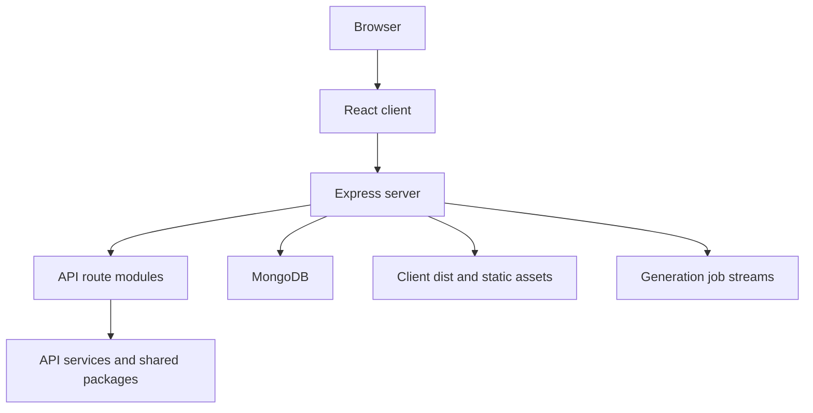
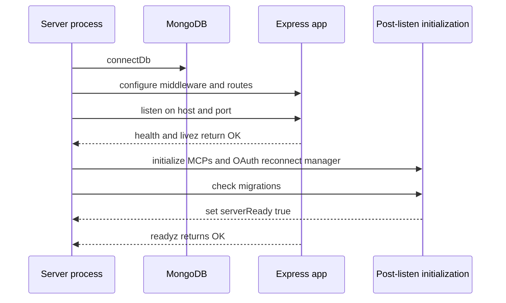

# Runtime architecture

The root package is an npm workspace containing `api`, `client`, and shared `packages/*`. Turbo orders workspace builds through upstream `build` dependencies; the data-schemas package depends on the data provider, and the API package depends on both (`package.json`, `turbo.json`). The runtime server is `api/server/index.js`, launched by `npm run backend` or `backend:dev`.

## Composition

This diagram shows the code-level runtime composition assembled by the Express entrypoint. The local Compose stack supplies MongoDB and optional supporting services; see [operations](../operations/configuration-and-deployment.md).

The Express entrypoint connects MongoDB before binding, starts index sync in the background, seeds data, loads base configuration, initializes storage and skills, runs startup checks, and updates interface permissions (`api/server/index.js`). It reads the built client `index.html` from the configured distribution path, serves static assets, mounts API routers, and falls back to the SPA for other unmatched paths. The client uses a browser router with `/c/:conversationId?` for chat and separate authenticated routes for search, prompts, skills, projects, and agents (`client/src/routes/index.tsx`). These product surfaces and their persisted counterparts are summarized in [product and data](../domain/product-and-data.md).

## Startup and readiness

This lifecycle is derived from `api/server/index.js`. `/health` and `/livez` always return 200 once routes are registered; `/readyz` returns 503 until post-listen initialization finishes. Boot failures before listening and initialization failures after listening terminate the process. Until ready, only POST starts below `/api/agents/chat` are rejected with a 503 and `Retry-After`; abort remains allowed. The resulting availability contract matters to [chat execution](../workflows/chat-and-agent-execution.md) and the Docker smoke gate described in [verification](../testing/verification.md).

## Request assembly and boundaries

Before route mounting, the server installs metrics, no-index, parsers with 50 MB limits, JSON-parse handling, Mongo sanitization, CORS, cookies, optional compression, and optional telemetry. It initializes Passport for JWT and other configured authentication, conditionally registers LDAP/social login, and installs a per-request capability context before API routes (`api/server/index.js`). The route mount table centralizes domains such as auth, admin, messages, conversations, prompts, projects, files, agents, configuration, memories, MCP, and Steel.

API fallthrough is intentionally distinct from browser fallthrough: unmatched `/api` paths receive the API not-found handler; other unmatched paths use the SPA fallback; error middleware is last. This makes `api/server/index.js` the first inspection point for cross-cutting middleware or a new top-level API surface; use the [source map](../source-map.md) to locate the domain router.

## Deployment-sensitive architecture

The entrypoint trusts the first proxy by default and supports strict tenant isolation. When `TENANT_ISOLATION_STRICT` is enabled, its own warning says the reverse proxy must strip or set `X-Tenant-Id` so clients cannot control it directly (`api/server/index.js`). The server rewrites the client base URL if `DOMAIN_CLIENT` contains a non-root path, while the client router takes its basename from the document’s `<base>` element. Configure and validate that operational coupling through [configuration and deployment](../operations/configuration-and-deployment.md), not independently.

## Change checklist

- Build dependent packages before diagnosing server import/build failures; the documented order is in `docs/local-dev.md`.
- Keep route ordering intact: static assets precede API mounts; unmatched API and SPA paths have different handlers.
- Do not treat `/health` as full readiness. Use `/readyz` for a complete post-listen boot check.
- Changes to authentication, capability context, tenancy, or middleware affect every route and should use the broad checks in [verification](../testing/verification.md).
