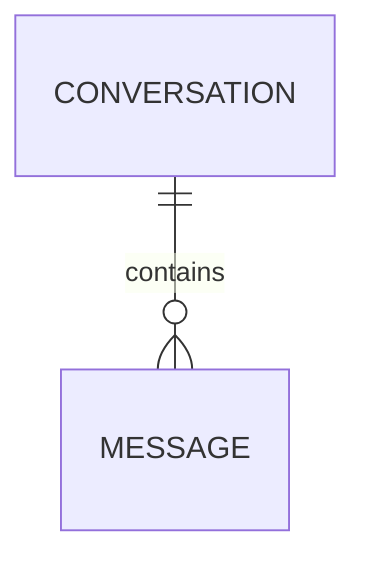

# Product concepts and data

LibreChat presents a unified AI chat interface with provider/model selection, custom endpoints, agents, MCP tools, skills, files, search, presets/prompts, sharing, authentication, and administration (`README.md`). The HTTP surface that exposes these concepts is assembled in `api/server/index.js`; its user-facing chat lifecycle is described in [chat and agent execution](../workflows/chat-and-agent-execution.md).

## Core concepts

| Concept | Product role | Evidence |
|---|---|---|
| User, session, token, key, balance | Identity, access/session state, credentials, and usage/balance support | `packages/data-schemas/src/models/index.ts` |
| Conversation and message | Durable chat container and individual exchanged content | `packages/data-schemas/src/models/index.ts`, `api/server/index.js` |
| Agent, agent API key, category, MCP server, tool call | Configured assistant automation, discovery, tool connectivity, and tool execution record | `packages/data-schemas/src/models/index.ts`, `README.md` |
| Assistant, preset, prompt, prompt group, action | Reusable interaction configuration and prompt/action surfaces | `packages/data-schemas/src/models/index.ts`, `api/server/index.js` |
| File, memory, skill, skill file, skill sync state | Uploaded content and reusable/contextual agent inputs | `packages/data-schemas/src/models/index.ts`, `README.md` |
| Role, group, ACL entry, system grant, audit log | Authorization, sharing, governance, and audit primitives | `packages/data-schemas/src/models/index.ts`, `README.md` |
| Config, banner, shared link, conversation tag, chat project | Runtime/UI configuration and conversation organization/sharing | `packages/data-schemas/src/models/index.ts`, `api/server/index.js` |

The shared data-schemas package’s `createModels` registers these model factories against Mongoose. That is evidence of model availability, not a complete schema contract; consult each model file before changing its fields, indexes, validation, or tenant behavior.

## Relationships at a glance

This diagram depicts the conversation/message relationship used by the chat execution path. `Conversation` and `Message` are both registered Mongoose models, use tenant-isolation plugins, and configure distinct Meilisearch indexes when the relevant search variables are supplied (`packages/data-schemas/src/models/convo.ts`, `packages/data-schemas/src/models/message.ts`). The generation controller persists a preliminary conversation and user message before streaming, then saves the final response before emitting the terminal event, linking the conversation/message concepts directly to [the execution workflow](../workflows/chat-and-agent-execution.md).

The model registry additionally registers user/session/token/key/balance, agents/tool calls, files, assistants/presets/prompts/actions, skills/memory, roles/groups/ACL/grants/audit, and configuration/organization models. Their exact ownership and cardinalities are schema-specific; the registry alone does not establish them (`packages/data-schemas/src/models/index.ts`).

## Route-facing product surfaces

The server mounts separate routes for messages, conversations, presets, projects, prompts, skills, categories, endpoints, models, assistants, files, sharing, roles, agents, memories, permissions, tags, and MCP, in addition to auth/admin/configuration paths (`api/server/index.js`). The client routes expose chat, search, prompts, skills, projects, and agent marketplace screens (`client/src/routes/index.tsx`). These do not imply a one-to-one model-to-route mapping: a route can aggregate several domain models and authorization policies.

## Domain-specific extensions in this checkout

The model registry also imports `steel` model factories, including working-order memory, AI runs/capabilities, source versions, tool calls, Excel exports, projects/sources, administrative imports/mapping/merge tables, memory candidates, memories, and OCR PDF chunk artifacts (`packages/data-schemas/src/models/index.ts`). `api/server/index.js` mounts `/api/steel` and `/api/admin/steel`. Treat this as a distinct source area when working on those domain extensions; its model registration alone does not establish the full workflow or external Postgres behavior.

## Change checklist

- Start with the relevant individual model factory, not only the registry, for field/index changes.
- Trace the mounted API router and its authorization middleware before changing user-visible semantics; use [the source map](../source-map.md).
- For chat persistence, preserve the sequencing guarantees in [chat and agent execution](../workflows/chat-and-agent-execution.md).
- Verify model or route changes with the scoped/broader checks in [verification](../testing/verification.md).
