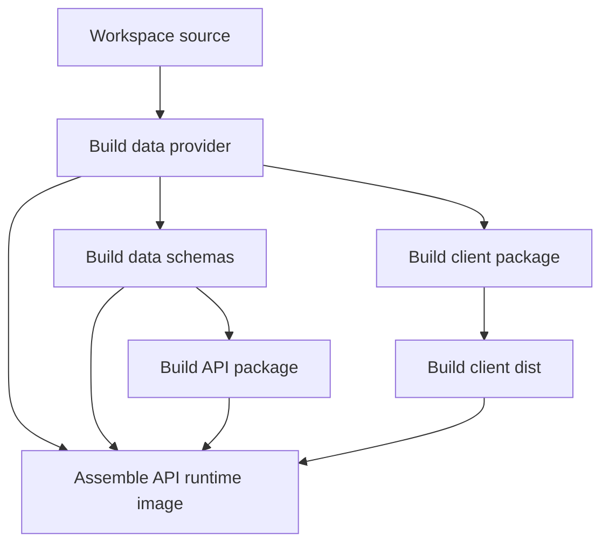

# Configuration and deployment

LibreChat’s documented local development requires a root `librechat.yaml` and a local `.env` containing the database URLs required by that setup. Use `librechat.example.yaml` as the non-secret reference for optional endpoints, MCP servers, storage, registration, and interface configuration; do not publish or commit local `.env` values (`docs/local-dev.md`). Runtime startup and probe semantics are defined in [architecture](../architecture/overview.md).

## Local configuration and startup

The minimal local YAML shown by `docs/local-dev.md` declares `version: 1.3.11`. That guide instructs developers to build the data-provider, data-schemas, API, and client workspace packages before building the browser client and starting the backend/frontend. The backend reads `client/dist/index.html` at startup, so `build:client` is necessary if that file is absent even when Vite serves the frontend separately.

The guide identifies `MONGO_URI` and any project-specific Postgres URL such as `STEEL_POSTGRES_URL` as backend requirements for its local setup. It also documents an optional S3 file strategy and advises keeping access keys out of version control. It gives a Meilisearch disablement path for local environments that do not require search. These are local operational directions, not a declaration of universally required production services.

## Compose topologies

The root `docker-compose.yml` labels itself as a base file not to edit directly and directs overrides to an override file. Its local stack defines:

- **api**: development LibreChat image, exposed on `${PORT}`, configured with an internal Mongo URI, Meilisearch URL, and RAG API URL; bind mounts local env, images, uploads, logs, and skills.
- **mongodb**: Mongo 8.0.20 with a local bind-mounted data directory.
- **meilisearch**: search service with its own persistent data bind mount.
- **vectordb**: pgvector Postgres backing the RAG service.
- **rag_api**: RAG image connected to the vector database.
- **admin-panel**: a separate browser admin service dependent on the API.

This topology supports the runtime data/services in [architecture](../architecture/overview.md), while the product-side capabilities are catalogued in [product and data](../domain/product-and-data.md).

The inspected `deploy-compose.prod.yml` is intentionally narrower: it starts an API container and a Caddy container. The API reads an external env file, mounts `/data`, starts via `deploy/host/start.sh`, and exposes a `/health` Docker healthcheck. Caddy exposes ports 80/443 and depends only on the API being started. This file does **not** define MongoDB, Meilisearch, vector storage, RAG, or an admin panel for production, so their production hosting/ownership cannot be inferred from it.

## Container build pipeline

`Dockerfile.multi` implements this dependency flow. Build stages use Node 24.16.0 Alpine for workspace builds, then assemble a Debian Bookworm slim API runtime. The runtime uses `npm ci --omit=dev`, copies built shared packages and `client/dist`, exposes port 3080, defaults `HOST=0.0.0.0`, and starts `node server/index.js`. The file’s comments tie the Debian runtime to PaddleOCR/OpenCV manylinux compatibility and install `uv`/`paddleocr-mcp` for extended MCP support. The production-image behavior is explicitly tested by [verification](../testing/verification.md).

## Health and readiness

The server exposes `/health`, `/livez`, and `/readyz`. Only `/readyz` waits for post-listen initialization including MCP/OAuth initialization and migration checks; `/health` and `/livez` return 200 earlier (`api/server/index.js`). The production Compose healthcheck uses `/health`, while Docker smoke CI polls `/readyz`. This is a material distinction: use `/readyz` when validating a complete boot and retain `/health` only where a liveness-style probe is intended.

## Tenant and deployment safety

`api/server/index.js` trusts one proxy by default. In strict tenant-isolation mode, it warns that an upstream reverse proxy or auth gateway must strip or set `X-Tenant-Id`; untrusted clients must not control the header. `DOMAIN_CLIENT` can cause the server to rewrite the client document’s base path, which the browser router uses as its basename. Coordinate proxy, tenancy, and subpath hosting changes across the server and client rather than changing one file in isolation.

## Change checklist

- Do not read, copy, or document `.env` secrets. Use sample configuration and named variables only.
- Build the matching workspace stages when changing a shared package; the root scripts and Turbo graph govern dependencies.
- Use Compose overrides rather than editing the documented base Compose file for local customization.
- For runtime image changes, run the production-image smoke checks described in [verification](../testing/verification.md).
