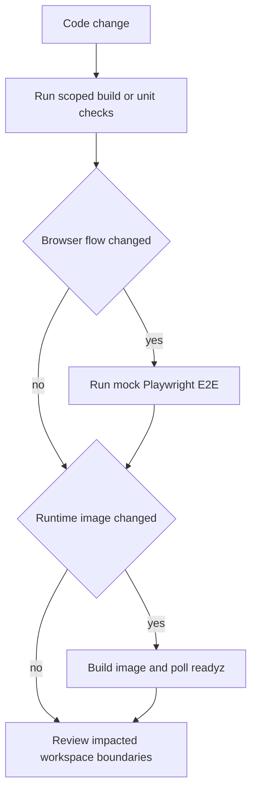

# Testing and verification

The root `package.json` defines workspace builds, scoped unit suites, Playwright E2E variants, linting, and formatting. CI supplements those commands with frontend build/type/unit checks, mock-LLM E2E, and production-image Docker smoke tests. Select checks based on the changed boundary identified in the [source map](../source-map.md), and include stream/recovery coverage for work described in [chat and agent execution](../workflows/chat-and-agent-execution.md).

## Verification ladder

| Change area | First checks | Broaden when needed | Evidence |
|---|---|---|---|
| Client UI or shared client/data-provider code | `npm run test:client`; relevant client typecheck/build | mock E2E | `package.json`, `.github/workflows/frontend-review.yml` |
| API server or shared API/schema code | `npm run test:api`; package tests for changed workspace | full build; Docker runtime smoke | `package.json`, `.github/workflows/docker-smoke.yml` |
| Shared packages | matching `build:*` and `test:packages:*` | `npm run build` or `test:all` | `package.json`, `turbo.json` |
| Browser interaction, routing, chat flow | `npm run e2e:mock` | `e2e:ci` or a focused Playwright configuration | `package.json`, `.github/workflows/playwright-mock.yml` |
| Dockerfile/runtime/startup change | Docker smoke workflow | inspect `/readyz` startup behavior | `.github/workflows/docker-smoke.yml`, `Dockerfile.multi` |

Useful root commands include `npm run build`, `npm run build:safe`, `npm run test:all`, `npm run lint`, `npm run sort-imports:check`, and the E2E aliases `e2e`, `e2e:ci`, `e2e:mock`, and `e2e:a11y` (`package.json`). The build graph runs dependencies first and writes `dist/**` outputs (`turbo.json`).

## CI coverage

The frontend-review workflow runs on pull requests affecting `client`, `packages/client`, or `packages/data-provider` (excluding Markdown-only changes). It builds data-provider and client-package artifacts, typechecks the client, runs `@librechat/client` tests, shards client tests across Ubuntu and Windows, and verifies a Vite build (`.github/workflows/frontend-review.yml`). This makes package build artifacts part of the client CI contract rather than optional local convenience.

The mock Playwright workflow builds data-provider, data-schemas, API, client package, and client app before running the mock-LLM Tier-1 E2E configuration. It uploads an HTML report and, on failure, traces/screenshots (`.github/workflows/playwright-mock.yml`). Use this path for browser-level flows without assuming a live external LLM provider.

This is the evidence-backed selection flow from root scripts and CI workflows; it does not replace feature-specific tests in the affected directory.

## Production-image smoke gate

The Docker smoke workflow builds the `client-package-build` target and the final production image from `Dockerfile.multi`. It first requires `@librechat/api` and its telemetry entry inside the pruned runtime image, then starts the real server against MongoDB. The job polls `/readyz` and fails if the container exits or never reaches 200. Its comments explicitly describe why this catches missing/externalized runtime dependencies and post-listen startup failures (`.github/workflows/docker-smoke.yml`).

That CI behavior verifies the readiness lifecycle in [architecture](../architecture/overview.md): `/readyz` becomes healthy only after MCP/OAuth initialization and migration checks. Do not substitute the Compose `/health` probe for this complete-boot test.

## Practical change checklist

1. Build every directly changed shared package and dependents required by the Turbo graph.
2. Run the smallest relevant unit suite before `test:all` or full E2E.
3. Run mock E2E for route, UI, chat, stream, or browser-state changes; inspect generated Playwright artifacts on failure.
4. Run Docker smoke for Dockerfile, API runtime dependency, startup, or production-image changes.
5. Report checks actually run and distinguish them from CI workflows only inspected in source.
