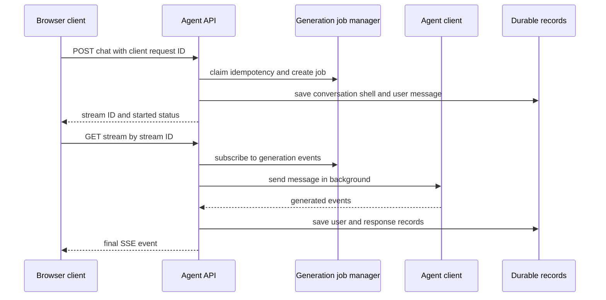

# Chat and agent execution

The authenticated browser chat route is `/c/:conversationId?` (`client/src/routes/index.tsx`). For agent execution, the API mounts `routes.agents` at `/api/agents`; OpenAI-compatible routes under `/v1` handle their own API-key authentication before the router installs JWT authentication, ban checks, and user-agent parsing (`api/server/routes/agents/index.js`, `api/server/index.js`). This workflow creates the conversations and messages described in [product and data](../domain/product-and-data.md), within the server lifecycle described in [architecture](../architecture/overview.md).

## Start, acknowledge, then stream

This is a two-phase, resumable protocol rather than a single long-lived POST. The controller normalizes a missing or `new` conversation ID to a UUID and uses it as the stream ID. It claims `clientRequestId` before job creation. A confirmed duplicate returns the existing stream and `status: resumed`, which prevents a retry from creating a second billed generation; a failed idempotency-store lookup is the explicit fail-open exception (`api/server/controllers/agents/request.js`). It applies the pending-request concurrency check after deduplication.

After creating the generation job, the controller saves a preliminary conversation shell for a new conversation, saves the preliminary user message, records job metadata, and responds `{ streamId, conversationId, status: 'started' }`. It only starts the agent’s background `sendMessage` after that acknowledgment. This ordering makes a duplicate browser tab or reconnection able to find resume state. The browser-side request/stream hooks are in `client/src/hooks/Chat/useChatFunctions.ts` and `client/src/hooks/SSE/useResumableSSE.ts`.

## Streaming and recovery

The stream endpoint is mounted before the main chat router specifically to avoid chat rate limiters for GET subscriptions. `GET /api/agents/chat/stream/:streamId` looks up the job and rejects a missing job, a mismatched user, or a mismatched tenant. It sends SSE headers disabling compression/buffering transformations and subscribes through `GenerationJobManager` (`api/server/routes/agents/index.js`).

A reconnect with `resume=true` uses `subscribeWithResume`: the server sends a sync event when resume state exists and can replay pending events when only a gap is available. A normal subscription uses `subscribe`. On client disconnect, the subscription is removed; disconnect does not automatically abort the generation. Consequently, preserving job ownership, stream IDs, and final persistence is central to the product’s resumable-stream behavior advertised in `README.md`.

## Completion, abort, and paused actions

The request controller emits a `created` event with the user/response IDs before normal response flow. At ordinary completion it saves the user and response records before emitting the final SSE event, then completes the job (`api/server/controllers/agents/request.js`). The client recognizes created, title, attachments, usage/context, pending-action, steering, and final events; final removes the active job and closes the SSE stream (`client/src/hooks/SSE/useResumableSSE.ts`).

`POST /api/agents/chat/abort` validates job user/tenant ownership, aborts the job, may persist a partial response, and prunes relevant agent checkpoints. Steering endpoints acknowledge a POST while their application events travel on the existing SSE stream. A tool-approval or ask-user pause leaves the job in `requires_action`; the normal controller avoids terminal completion and `/resume` is responsible for continuation (`api/server/routes/agents/index.js`, `api/server/controllers/agents/request.js`, `api/server/routes/agents/chat.js`).

## Guardrails and failure behavior

- Before the application is ready, the server rejects new chat POSTs with 503 and `Retry-After: 1`, but allows aborts. The readiness rationale is documented in [architecture](../architecture/overview.md).
- The chat router layers configuration, optional rate limits, PII filtering, moderation, agent-use authorization, agent-resource view authorization, conversation authorization, and endpoint-option construction (`api/server/routes/agents/index.js`, `api/server/routes/agents/chat.js`).
- Stream subscriptions enforce user and tenant equality against job metadata. Do not weaken these checks to make reconnection easier.
- A stream 404 after a completed/cleaned job is designed to recover through the client’s persisted-message path rather than starting a duplicate generation (`api/server/controllers/agents/request.js`).

## Change checklist

1. Trace both the POST acknowledgement and GET stream subscription; a change to only one half can break resumes.
2. Keep `clientRequestId` idempotency ahead of the concurrency limiter.
3. Preserve durable-save-before-final-event ordering so a reconnect can recover completed content.
4. Test UI behavior with the E2E/build guidance in [verification](../testing/verification.md), and inspect the route/controller locations in the [source map](../source-map.md).
